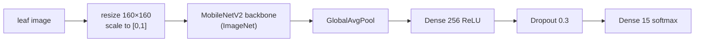

# Plant Disease Classification — MobileNetV2

[](https://github.com/SASHI117/Plant-Disease-Classification/actions/workflows/ci.yml)
[](https://colab.research.google.com/github/SASHI117/Plant-Disease-Classification/blob/main/plant_disease_prediction.ipynb)


A leaf-image classifier for **15 pepper, potato and tomato conditions**, built by fine-tuning an
ImageNet MobileNetV2 on the PlantVillage dataset and served through a Gradio app. The trained model
(10.9 MB) is included, so the demo runs straight after cloning.

| | |
|---|---|
| **Validation accuracy** | **94.3%** on 4,134 held-out images |
| **Model** | MobileNetV2 + dense head, 2.59 M parameters, 10.9 MB |
| **Speed** | ~100 ms per image on a laptop CPU |
| **Classes** | 15 (bell pepper, potato, tomato; diseases + healthy) |


## Quick start

```bash
pip install -r requirements.txt       # tensorflow-cpu works fine for inference
python predict.py leaf1.jpg leaf2.jpg # top-3 per image
python app.py                         # Gradio UI at http://127.0.0.1:7860
```

```text
leaf.jpg
   99.4%  Tomato - Late blight
    0.6%  Tomato - Septoria leaf spot
    0.0%  Potato - Late blight
```

## Model



Training uses the standard two-phase transfer-learning schedule: first train a new head on the
frozen backbone, then unfreeze the top of the backbone at a lower learning rate.

| Phase | Trainable | LR | Epochs | Val accuracy |
|---|---|---|---|---|
| 1. head only | new layers | 1e-3 | 3 | 0.882 |
| 2. fine-tune | + last 40 backbone layers | 1e-4 | 4 | **0.943** |

Augmentation: rotation ±25°, shifts 15%, zoom 15%, horizontal flip. Data: the Kaggle
[`emmarex/plantdisease`](https://www.kaggle.com/datasets/emmarex/plantdisease) release of
PlantVillage (20,638 images), split 80/20 per class with a fixed seed.

**Why MobileNetV2 at 160 px.** The target is a phone or a small CPU server in the field, not a GPU.
Depthwise-separable convolutions keep the model at 2.6 M parameters and 10.9 MB. The whole 7-epoch
run trained on Colab without a GPU in about 75 minutes, and inference takes about 100 ms per leaf on
a laptop CPU. The 160 px input, rather than MobileNetV2's native 224 px, keeps both costs down.

## Evaluation tooling

- `evaluate.py` scores any folder of labelled images with the same loader used in training. It
  writes per-class precision/recall/F1 to `metrics.json` and a row-normalized confusion matrix.
- `scripts/fetch_plantvillage_sample.py` builds a class-balanced sample from the original
  [PlantVillage release](https://github.com/spMohanty/PlantVillage-Dataset), for testing on images
  from outside the training copy.

## Reproducing

```bash
# training (about 75 min on Colab without a GPU; much faster with one)
kaggle datasets download -d emmarex/plantdisease && unzip -q plantdisease.zip -d data
python train.py --source data/PlantVillage --work data/split

# per-class evaluation
python evaluate.py data/split/valid --out reports/valid
```

The notebook is the original Colab run, with its training logs.

## Repository

| Path | |
|---|---|
| `predict.py` | model loading, preprocessing identical to training, top-k, CLI |
| `app.py` | Gradio demo |
| `train.py` / `evaluate.py` | training and per-class evaluation outside Colab |
| `models/` | `plant_model_fast.keras` + `class_names.json` (the class order the model was trained with) |
| `tests/` | class order, preprocessing, and a real forward pass. Run in CI |
| `plant_disease_full_report.pdf` | project report |

## Roadmap

- Export to TensorFlow Lite for on-device inference.
- Grad-CAM heatmaps to show which part of the leaf drove each prediction.
- More crops, and an "unknown / not a leaf" class for out-of-scope images.
- Field photos with cluttered backgrounds and varied lighting in the training mix.

## References

- Hughes & Salathé (2015), *An open access repository of images on plant health…* (PlantVillage), arXiv:1511.08060
- Mohanty, Hughes & Salathé (2016), *Using Deep Learning for Image-Based Plant Disease Detection*, Frontiers in Plant Science
- Sandler et al. (2018), *MobileNetV2: Inverted Residuals and Linear Bottlenecks*, CVPR
