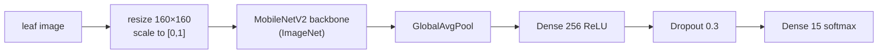
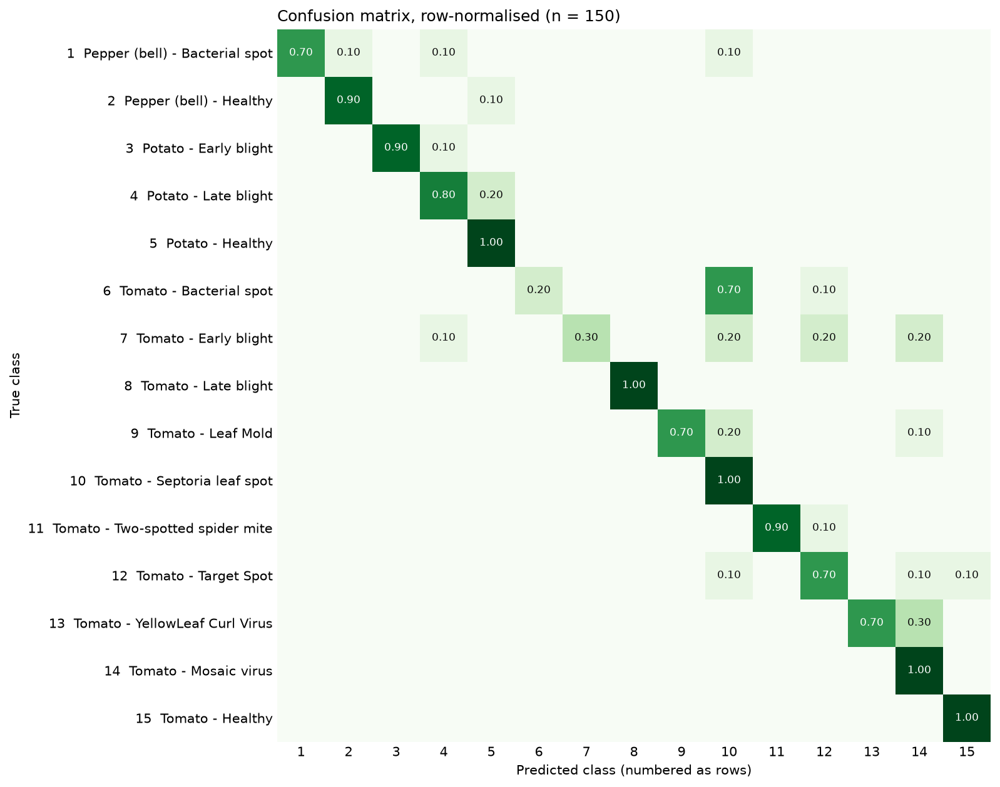

# Plant Disease Classification — MobileNetV2

[](https://github.com/SASHI117/Plant-Disease-Classification/actions/workflows/ci.yml)
[](https://colab.research.google.com/github/SASHI117/Plant-Disease-Classification/blob/main/plant_disease_prediction.ipynb)


A leaf-image classifier for **15 pepper, potato and tomato conditions**. It
fine-tunes an ImageNet MobileNetV2 on a PlantVillage subset and is served
through a Gradio app. The trained model (10.9 MB) is in the repo, so the
demo runs straight after cloning. No dataset download is needed for inference.

| | |
|---|---|
| Validation accuracy (Kaggle copy, 4,134 held-out images) | **94.3 %** |
| Accuracy on an independent sample from the original PlantVillage release (150 images) | **78.7 %** (macro-F1 0.777) |
| Model size / latency | 2.59 M params, 10.9 MB · ~100 ms per image on a laptop CPU (batch 1) |

The gap between those two numbers is the most useful result here. It's
explained [below](#how-well-does-it-actually-work).


## Quick start

```bash
pip install -r requirements.txt       # tensorflow-cpu works fine for inference
python predict.py leaf1.jpg leaf2.jpg # top-3 per image
python app.py                         # Gradio UI at http://127.0.0.1:7860
```

```text
leaf.jpg
   99.4%  Tomato - Late blight
    0.6%  Tomato - Septoria leaf spot
    0.0%  Potato - Late blight
```

## Model



Training is two-phase: the recommended way to adapt a pretrained backbone
without wrecking its features.

| Phase | Trainable | LR | Epochs | Val acc at end |
|---|---|---|---|---|
| 1. head only | new layers | 1e-3 | 3 | 0.882 |
| 2. fine-tune | + last 40 backbone layers | 1e-4 | 4 | **0.943** |

Augmentation: rotation ±25°, shifts 15%, zoom 15%, horizontal flip. The
data is the Kaggle [`emmarex/plantdisease`](https://www.kaggle.com/datasets/emmarex/plantdisease)
copy of PlantVillage (20,638 images), split 80/20 per class with a fixed seed.

**Why MobileNetV2 at 160 px.** The target is a phone or a small CPU server in
the field, not a GPU. Depthwise-separable convolutions keep the model at
2.6 M parameters and 10.9 MB. It trained on Colab without a GPU (about 75
minutes for the 7 epochs in the notebook log) and classifies a leaf in about
100 ms on a laptop CPU. The 160 px input, rather than MobileNetV2's native
224 px, keeps both costs down.

## How well does it actually work?

The 94.3% comes from a random split of one Kaggle copy. PlantVillage has
several photos per physical leaf, all shot in the same lab setup, so a
random split puts near-identical images on both sides and flatters the
score. To check this, `scripts/fetch_plantvillage_sample.py` draws 10 images
per class from the **original PlantVillage release**
([spMohanty/PlantVillage-Dataset](https://github.com/spMohanty/PlantVillage-Dataset)),
and `evaluate.py` scores them with the same loader used in training:



- **78.7% accuracy on the same 15 classes, from the same source dataset.**
  Even images whose IDs the Colab run listed in its own validation split
  scored 15 of 19 here, which points to the Kaggle files having been
  re-encoded or processed. The model has learned something specific to that
  copy.
- **Septoria leaf spot is a sink class.** It absorbs 70% of tomato Bacterial
  spot and 20% of Early blight and Leaf Mold. All of these are small dark
  lesions, the hardest visual distinction in the set.
- **Virus and blight pairs get confused:** Yellow Leaf Curl vs Mosaic
  (30%), potato Late vs Early blight.
- Late blight and all "healthy" classes are recognized reliably.

With n = 10 per class, each per-class number has a wide interval (about ±25
points at 95%). The overall pattern is clear, but the individual cells aren't
precise. Full metrics are in
[`docs/pv_sample/metrics.json`](docs/pv_sample/metrics.json).

**What would move it:** train on the original release rather than a
re-encoded copy; group the split by leaf so near-duplicates can't straddle
train and validation; use MobileNetV2's own `preprocess_input` (scale to
[-1, 1]) instead of `/255`; and add stronger colour/blur augmentation.
Field photos (cluttered backgrounds, several leaves, variable light) will be
harder than either number here. Mohanty et al. (2016) reported accuracy
falling to about 31% on images from outside PlantVillage.

## Reproducing

```bash
# training (about 75 min on Colab without a GPU; much faster with one)
kaggle datasets download -d emmarex/plantdisease && unzip -q plantdisease.zip -d data
python train.py --source data/PlantVillage --work data/split

# evaluation on the held-out split, or on the external sample
python evaluate.py data/split/valid --out reports/valid
python scripts/fetch_plantvillage_sample.py --per-class 10 --out data/pv_sample
python evaluate.py data/pv_sample --out reports/pv_sample
```

The notebook is the original Colab run, cleaned up, with its training logs kept.

## Repository

| Path | |
|---|---|
| `predict.py` | model loading, preprocessing identical to training, top-k, CLI |
| `app.py` | Gradio demo |
| `train.py` / `evaluate.py` | training and per-class evaluation outside Colab |
| `models/` | `plant_model_fast.keras` + `class_names.json` (the class order the model was trained with) |
| `tests/` | label order, preprocessing, and a real forward pass. Run in CI |
| `plant_disease_full_report.pdf` | project report |

## Limitations

- Only 3 crops and 15 conditions. Anything else is forced into one of these
  classes. There is no "unknown" option.
- Lab images: single leaf, plain background. Expect lower accuracy on field photos.
- The confidence scores are softmax outputs, not calibrated probabilities.

## References

- Hughes & Salathé (2015), *An open access repository of images on plant health…* (PlantVillage), arXiv:1511.08060
- Mohanty, Hughes & Salathé (2016), *Using Deep Learning for Image-Based Plant Disease Detection*, Frontiers in Plant Science
- Sandler et al. (2018), *MobileNetV2: Inverted Residuals and Linear Bottlenecks*, CVPR
